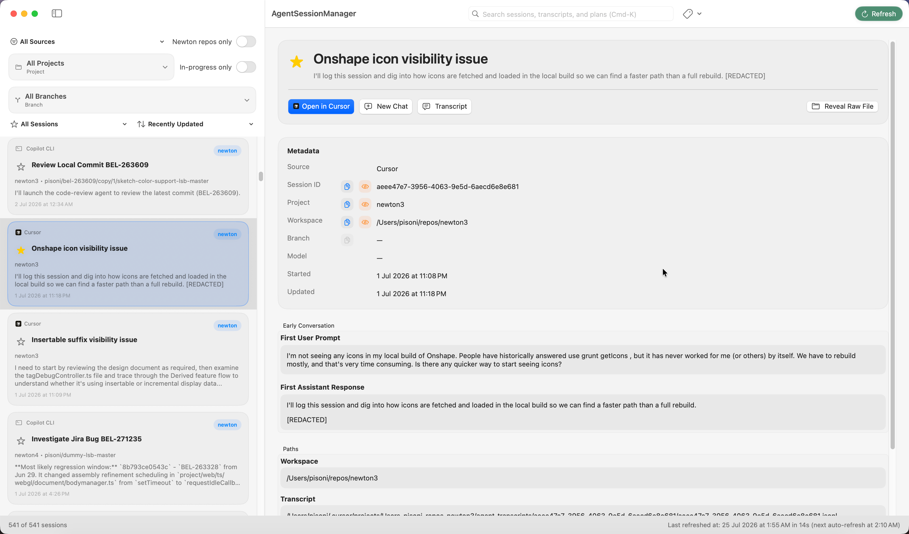
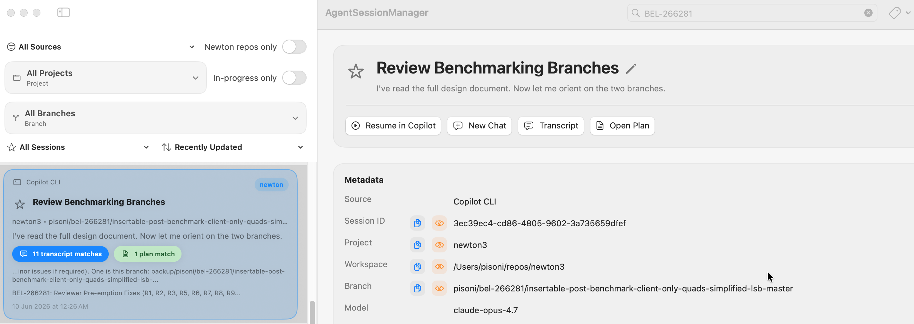
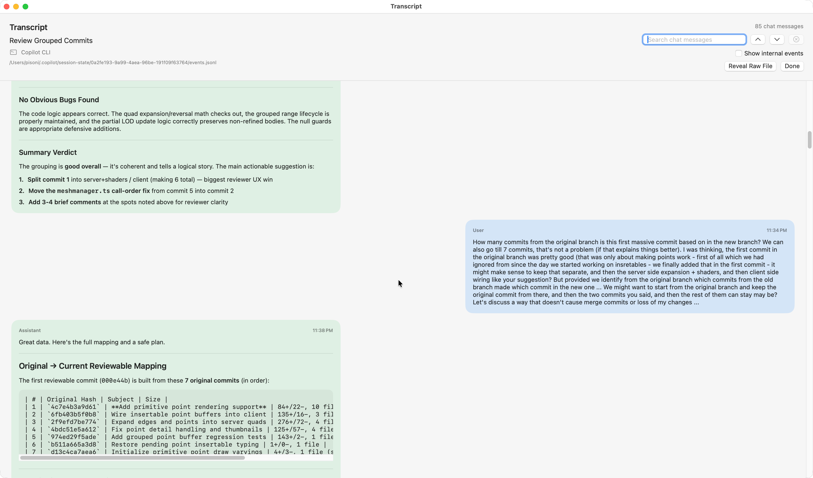
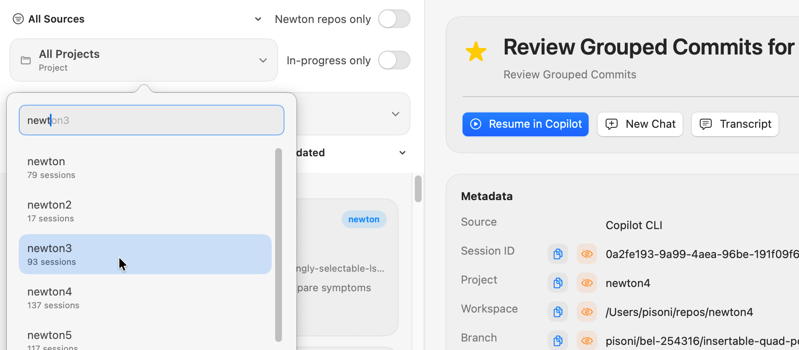
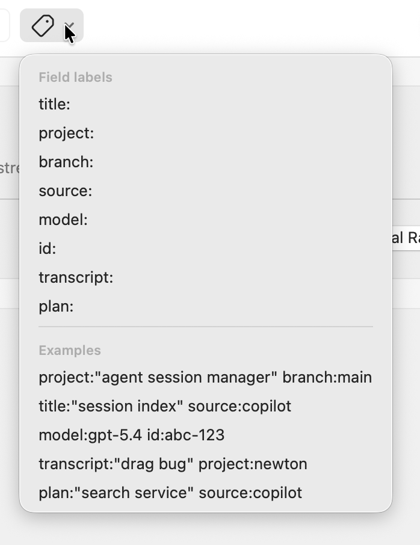
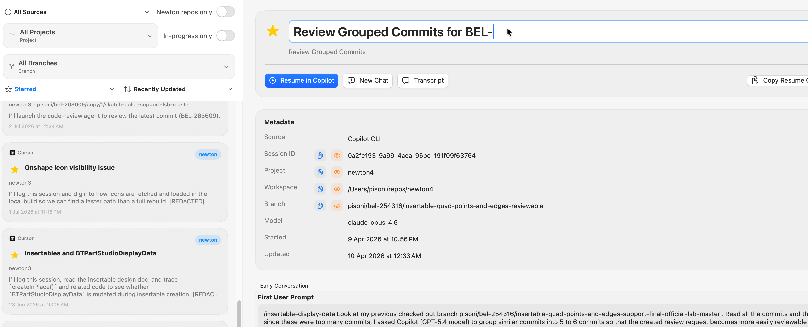

# Agent Session Manager

**One searchable home for every AI coding conversation you've ever had.**

A native macOS app (with a companion CLI) that indexes every session across **GitHub Copilot CLI**, **Cursor**, **VS Code Copilot**, and **Claude Code** (CLI, VS Code, and Desktop) into a single local catalog - so you can search, filter, star, rename, and resume any conversation in seconds. It reads your existing session stores in place and never modifies them (beyond a title you explicitly rename).

<!-- SCREENSHOT: 01-hero.png -->
<p align="center">
  
</p>
<p align="center"><em>Every AI coding session from every tool, in one list - with full-text search across titles, transcripts, and plans.</em></p>

---

## The Problem

Working across multiple AI agents, I'd constantly lose track of *where* a conversation happened - which assistant, which project (I have several `newton` repos!), which branch. And you can't resume a conversation you can't find.

Each harness makes this hard in its own way. Some keep one flat list, others split it per project. All of them only let you search the inferred *title* - useless when the only thing you remember is a phrase from deep inside the transcript. And they all store sessions locally, in different places, in formats that aren't human-readable.

Agent Session Manager fixes this. It indexes every source into one local catalog and lets you search not just titles and metadata, but the **full transcript text and your implementation plans** - then renders any of them beautifully and resumes them with a click. There's even a CLI so you (or your AI agents) can query your past conversations in natural language.

---

## See It In Action

<!-- SCREENSHOT: 02-search-matches.png -->
<p align="center">
  
</p>
<p align="center"><em>Deep search: a single query matches inside transcripts <em>and</em> plans at once - cards surface <strong>"N transcript matches"</strong> and <strong>"N plan matches"</strong> pills with the exact snippet. Click a pill to jump straight to that match.</em></p>

<!-- SCREENSHOT: 06-transcript-viewer.png -->
<p align="center">
  
</p>
<p align="center"><em>Built-in transcript viewer: clean user and assistant turns with full markdown - headings, lists, tables, and code. Press Cmd-F for browser-style Find that highlights matches in place with a "Message N of M" indicator, and collapse internal tool calls to stay focused.</em></p>

---

## Why Use It

- **One place for everything.** Stop hunting across half a dozen storage locations to find that conversation where you debugged a tricky issue last week.
- **Deep transcript and plan search.** Search full transcript and plan text - not just titles - to find the exact conversation where you discussed a specific class, error message, or design decision.
- **Instant resume.** One click to resume a Copilot CLI or Claude Code (CLI/Desktop) session, reopen a workspace in Cursor or VS Code, or reveal a raw file.
- **Star and organize.** Star important sessions so they float to the top. Filter by source, project, branch, in-progress, or starred status, and sort however you like.
- **Rename in place.** Give Copilot CLI and Claude Code (CLI, VS Code, Desktop) sessions a proper title, right from the detail pane.
- **Near read-only.** The app never touches your session data beyond a title you explicitly rename (see [Renaming Sessions](#renaming-sessions)). Everything else lives in its own lightweight SQLite catalog.
- **CLI for automation.** The companion `agent-session-manager` command searches your history from the terminal, pipes results as JSON, or lets other AI agents query your past conversations programmatically.

---

## Key Features

### Session Browser (GUI)

| Feature | Description |
|---------|-------------|
| **Unified session list** | Card-based list showing sessions from every supported source with official app icons |
| **Rich filtering** | Filter by source (Copilot CLI / Cursor / VS Code Copilot / Claude Code CLI / Claude Code VS Code / Claude Desktop), project, branch, starred status, in-progress status, and Newton repos - with autocomplete popovers for project/branch, plus a sort control |
| **Full-text search** | Toolbar search matches session metadata and indexed transcript **and plan** contents as you type |
| **Label search syntax** | Use `title:`, `project:`, `branch:`, `source:`, `model:`, `id:`, `transcript:`, and `plan:` labels for precise queries - discoverable from the toolbar's **Labels** menu |
| **Star sessions** | Persist star/unstar across refreshes - starred sessions float to the top of the list |
| **Rename sessions** | Edit the title in place (pencil icon in the detail pane, 100-character limit) for Copilot CLI and all three Claude Code sources; disabled while a session is in progress |
| **In-progress detection** | Copilot CLI and Claude Code CLI sessions show a live "In Progress" indicator, and resuming one prompts for confirmation first |
| **One-click actions** | Resume Copilot CLI and Claude Code CLI sessions, resume Claude Desktop sessions in-app via `claude://resume`, open workspaces in Cursor or VS Code, reveal raw files in Finder |
| **Start new conversation** | Launch a new AI session in the same project workspace with the **New Chat** button |
| **In-app transcript viewer** | Read the full conversation in a separate window, with browser-style Find: highlights every match in place (no filtering), shows a "Message N of M" indicator, and steps between matches with buttons, Enter, or Cmd-G / Cmd-Shift-G; internal tool calls collapse by default |
| **In-app plan viewer** | Open a session's plan.md in the built-in viewer, including Cursor-linked plans under `~/.cursor/plans`, with the same browser-style Find (a "Section N of M" indicator stepping through markdown blocks) and a default-app fallback |
| **Detail pane metadata** | See source, session ID, project, branch, workspace path, model info, timestamps, and first-message previews at a glance, each with copy and quick-exclude buttons |
| **Copy buttons** | Quickly copy session ID, workspace path, transcript path, a Copilot/Claude CLI resume command, or a Claude Desktop resume link to the clipboard |
| **Auto-refresh** | Configurable timer refresh, launch refresh, and optional deferral of scheduled refreshes while the app is active |
| **Incremental refresh** | Only reparses sessions whose files actually changed - fast even with thousands of sessions |
| **Index management** | Settings → Indexes lets you include/exclude specific projects, branches, or sessions from the catalog, with search, an All/Included/Excluded filter, and select-all |
| **Menu commands** | Catalog menu (Refresh Sessions ⌘R, Rebuild Session Index, Open Index Folder) and CLI menu (Install CLI to PATH) |
| **Settings** | General (Launch at Login, Newton repos path, auto-refresh timing/deferral) and Indexes (catalog inclusion/exclusion) pages (Settings → ⌘,) |

#### Filter and sort exactly what you need

<!-- SCREENSHOT: 03-filters.png -->
<p align="center">
  
</p>
<p align="center"><em>Source, project, branch, starred, in-progress, Newton-only, and sort - all in the filter bar. Project and branch open autocomplete popovers with live session counts.</em></p>

#### Structured search, discoverable from the toolbar

<!-- SCREENSHOT: 04-labels-menu.png -->
<p align="center">
  
</p>
<p align="center"><em>The <strong>Labels</strong> menu lists every field label with a hint, plus ready-to-click example queries.</em></p>

#### Star what matters, rename anything

<!-- SCREENSHOT: 05-star-rename.png -->
<p align="center">
  
</p>
<p align="center"><em>Star sessions so they float to the top (filter to just your starred set), and rename any Copilot CLI or Claude Code session in place - a proper title instead of an auto-generated one.</em></p>

### Companion CLI

The `agent-session-manager` command provides the same search capabilities from the terminal:

```bash
# Search across all sessions
agent-session-manager search --query 'auth bug'

# Search within transcript text for a specific term
agent-session-manager search --query 'transcript:"insertable display data"'

# Search within plan text for a specific term
agent-session-manager search --query 'plan:"search service"'

# Filter by project and branch
agent-session-manager search --query 'project:newton5 branch:master'

# Only Cursor sessions from the last week, as JSON
agent-session-manager search --query 'source:cursor' --within 1w --json

# Newton repos only, starred sessions
agent-session-manager search --query 'drag bug' --newton-only --starred

# Refresh the catalog first, then search
agent-session-manager search --query 'plan update' --refresh --limit 10
```

**CLI options:**

| Option | Description |
|--------|-------------|
| `--query <text>` | Search using label syntax (same as the app toolbar) |
| `--search <text>` | Top-level alias for `--query` |
| `--project <name>` | Restrict to one project |
| `--branch <name>` | Restrict to one branch |
| `--source <source>` | Restrict to one source: `copilot-cli`, `cursor`, `vscode-copilot`, `claude-code-cli`, `claude-code-vscode`, or `claude-desktop` (aliases: `claude`, `claude-cli`, `claude-code`) |
| `--newton-only` | Restrict to Newton repos only |
| `--starred` | Only starred sessions |
| `--unstarred` | Only unstarred sessions |
| `--refresh` | Refresh the catalog before searching |
| `--within <duration>` | Time window filter: `30m`, `12h`, `1d`, `1w` |
| `--limit <count>` | Cap the number of results |
| `--json` | Emit machine-readable JSON output |

Results (human-readable or JSON) include transcript and plan match counts and snippets whenever the query matched inside a `transcript:`/`plan:` clause or the free-text search.

**Use from other AI agents:** The `--json` flag makes it straightforward for Copilot CLI, Cursor, or any scripted workflow to query your past sessions programmatically. For example, an AI agent could search for how you solved a similar problem before, or check which branches you've been working on recently.

---

## How to Use

### Install

1. Clone the repository and run the build script:

   ```bash
   git clone <repo-url>
   cd agent-session-manager
   ./build.sh
   ```

2. The build script installs:
   - **App** → `/Applications/AgentSessionManager.app`
   - **CLI** → `/usr/local/bin/agent-session-manager`

3. Launch the app from `/Applications` or Spotlight.

4. Alternatively, use the app's **CLI → Install CLI to PATH** menu command at any time. It symlinks the bundled CLI helper into the first writable directory on your `PATH`, falling back to `~/.local/bin` and adding that to your `PATH` via `~/.zprofile` if needed - no `sudo` required.

### First Launch

On first launch the app performs an initial scan of all supported session stores and builds the SQLite catalog. This takes a few seconds depending on how many sessions you have. Subsequent launches use incremental refresh - only changed sessions are re-indexed.

### Searching

Type in the toolbar search field (⌘K to focus) to search across session titles, project names, branches, and transcript/plan text. Use label prefixes for targeted searches:

```
transcript:"memory leak"          # find conversations mentioning "memory leak"
plan:"search service"             # find plans mentioning "search service"
project:newton5 branch:master     # sessions in newton5 on master
source:cursor                     # only Cursor sessions
title:"plan update"               # match session titles
```

Sessions with a transcript or plan match show a corresponding match-count pill on the card; clicking it opens the transcript or plan viewer with Find already landed on the first match. The **Labels** button next to the search field lists every label with a hint and a set of ready-to-use example queries.

### Starring

Click the star icon on any session card to pin it. Starred sessions float to the top of the list and persist across app relaunches and catalog refreshes.

### Renaming Sessions

Click the pencil icon next to a session's title in the detail pane to rename it (100-character limit). Supported for Copilot CLI, Claude Code CLI, Claude Code VS Code, and Claude Desktop sessions; disabled while a session is in progress. This is the one case where the app writes back to the original source: Copilot CLI renames update `workspace.yaml`, and Claude sources record the new title as a `custom-title` entry in the session's own JSONL (or metadata file, for Desktop) - nothing else about the source data is ever touched.

### In-Progress Sessions

Copilot CLI and Claude Code CLI sessions that are actively running show an "In Progress" indicator on the card and detail pane. Resuming one of these prompts for confirmation before reconnecting, since another terminal may already be attached.

### Resuming Sessions

Each session's detail pane shows a primary action button:
- **Copilot CLI** → "Resume in Copilot" - reconnects to the exact session via `copilot --resume`
- **Claude Code CLI** → "Resume in Claude" - reconnects to the exact session via `claude --resume`
- **Claude Desktop** → "Resume in Claude Desktop" - resumes the exact conversation inside the Claude Desktop app via its `claude://resume?session=<id>` deep link, using Desktop's own session id so it reopens cleanly instead of spawning a duplicate; "Resume in Terminal" (`claude --resume`) is offered as a secondary action
- **Cursor** / **VS Code Copilot** / **Claude Code VS Code** → "Open in Cursor" / "Open in VS Code" - opens the workspace in the editor
- If the workspace path can't be resolved → "Reveal Raw File" - opens Finder to the raw file

### Viewing Transcripts

Click **Transcript** in the detail pane to open the full conversation in a separate window. Internal tool-call events are collapsed by default for readability. Press ⌘F to focus Find: matches are highlighted in place (no filtering), a "Message N of M" indicator tracks position, and Enter or ⌘G / ⇧⌘G step to the next/previous match.

### Viewing Plans

Click **Open Plan** in the detail pane to open a session's plan.md in the built-in viewer, including Cursor-linked plans stored under `~/.cursor/plans`. Find works the same way as in the transcript viewer, stepping between markdown blocks that contain a match with a "Section N of M" indicator; a default-app fallback is available from the viewer if you'd rather open the raw file.

### Managing the Index

Open **Settings → Indexes** (⌘,) to include or exclude specific projects, branches, or sessions from the catalog. Switch scope with the segmented control, search within the current scope, filter by All/Included/Excluded, use Select All to toggle everything currently visible, then apply with "Include Selected" or "Exclude Selected". Excluded items are hidden from search and the session list but their source files are left untouched.

### Settings

Open **Settings** (⌘,) to configure:
- **General** - Launch at Login, Newton repos path, and Auto Session Refresh (timer interval, active-use deferral, and launch-trigger behavior)
- **Indexes** - catalog inclusion/exclusion for projects, branches, and sessions (see [Managing the Index](#managing-the-index))

---

## Data Storage

| What | Where |
|------|-------|
| SQLite catalog | `~/Library/Application Support/AgentSessionManager/catalog.sqlite3` |
| Starred sessions & catalog exclusions | Stored alongside the catalog (never modifies source files) |
| Copilot CLI sessions (source) | `~/.copilot/session-state/` (renames write the title back to that session's `workspace.yaml`) |
| Cursor sessions (source) | `~/.cursor/projects/`, `~/.cursor/User/workspaceStorage/`, and `~/.cursor/User/globalStorage/` |
| VS Code Copilot sessions (source) | `~/Library/Application Support/Code/User/workspaceStorage/` |
| Claude Code sessions - CLI, VS Code & Desktop (sources) | `~/.claude/projects/` (split by each session's `entrypoint`; renames append a `custom-title` record to that session's JSONL) |
| Claude Desktop session titles | `~/Library/Application Support/Claude/claude-code-sessions/` (joined by `cliSessionId`; renames write back here) |

The app is otherwise **read-only** - it indexes the source directories and never writes to them beyond the title updates described above for sessions you explicitly rename.

---

## Building from Source

### Prerequisites

- macOS 14+
- Xcode 16+
- [XcodeGen](https://github.com/yonaskolb/XcodeGen) (`brew install xcodegen`)

### Build and Install

```bash
./build.sh
```

This:
1. Runs `xcodegen generate` to produce the Xcode project
2. Builds a Release configuration
3. Stamps the version automatically
4. Closes any running instance of the app
5. Installs to `/Applications/AgentSessionManager.app`
6. Symlinks the CLI to `/usr/local/bin/agent-session-manager`

To build the same Release app for CI without installing it locally:

```bash
./build.sh --ci-package --output-dir build/artifacts
```

That leaves a zipped app bundle in `build/artifacts/`.

### Development

For iterating in Xcode:

```bash
xcodegen generate
open AgentSessionManager.xcodeproj
```

To run tests:

```bash
xcodebuild -project AgentSessionManager.xcodeproj -scheme AgentSessionManager -destination 'platform=macOS' test
```

### GitHub Actions deploy flow

- Pushes to `master` build the Release app, zip `AgentSessionManager.app`, and upload it as a workflow artifact.
- Pushes of release tags matching `v*` do the same build/package step and also publish the zip to the matching GitHub Release.
- The workflow lives at `.github/workflows/deploy.yml`.

The easiest way to publish a new release package is:

```bash
git checkout master
git pull --ff-only
git tag -a v1.2.3 -m "Release v1.2.3"
git push origin v1.2.3
```

That tag push creates or updates the GitHub Release for `v1.2.3` and uploads the packaged app zip.

### Project Structure

| File | Purpose |
|------|---------|
| `.github/workflows/deploy.yml` | Builds Release artifacts on `master` and publishes tagged releases |
| `Sources/Models.swift` | Session types, filter/sort state, source definitions |
| `Sources/Adapters.swift` | Scanners for Copilot CLI, Cursor, VS Code, and Claude Code stores (also handles session renames) |
| `Sources/Storage.swift` | SQLite catalog - persistence, transcript/plan search index, catalog exclusions, migrations |
| `Sources/SessionFiltering.swift` | Shared scope-filter and list-ordering logic used by the app and CLI |
| `Sources/SessionSearchService.swift` | Catalog search execution shared by the app toolbar and CLI |
| `Sources/ViewModel.swift` | App state, refresh, search, filter, rename, and action wiring |
| `Sources/ContentView.swift` | SwiftUI list/detail browser UI, transcript/plan viewers with Find |
| `Sources/SettingsView.swift` | Settings dialog (General and Indexes pages) |
| `Sources/SettingsModels.swift` | Auto-refresh cadence, settings snapshot, and persistence types |
| `Sources/AppSettings.swift` | Launch-at-Login controller and app settings store |
| `Sources/CLIPathInstaller.swift` | "Install CLI to PATH" menu command implementation |
| `Sources/SessionSearchCLI.swift` | CLI search command parser and executor |
| `Sources/Utilities.swift` | Path helpers, transcript/plan parsing, markdown rendering, text cleanup |
| `Sources/TranscriptDocumentCache.swift` | Caches parsed transcript documents by fingerprint |
| `build.sh` | Build, version-stamp, and install script |
| `project.yml` | XcodeGen project definition |
